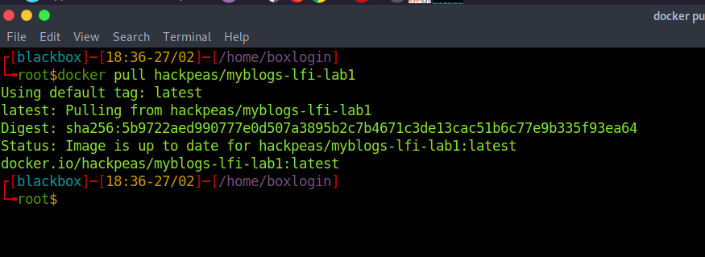
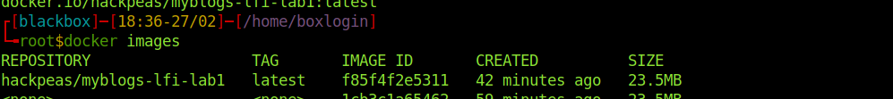
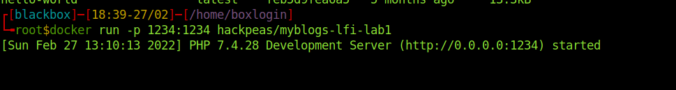
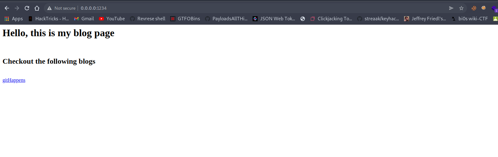

<h1><centre>CTFs</centre></h1>

<h2> CTF - myBlogs </h2>

<b>Description</b>: Simple Blog page, to render files on the web page... 

<b> Task </b>:flag.txt file is stored along with other blog files, hope you can see it content... 
Reference : https://portswigger.net/research/server-side-template-injection  
<b> Walkthrough </b>: Coming Soon   

<h2> Environment Setup </h2>
1 Install docker.io in your machine

for debian based linux:

> apt-get install docker.io

for windows:

follow the documentation: https://docs.docker.com/desktop/windows/install/

2 Pull the lab

> docker pull hackpeas/myblogs-lfi-lab1

confirm that image is successfully pulled, with the following command

> docker images

You can see the image hackpeas/myblogs-lfi-lab1

3 Running the image

> docker run -p 1234:1234 hackpeas/myblogs-lfi-lab1

Now you can access the web application by visiting the url.

Note: you can check the vulnerable source code in this repo.

