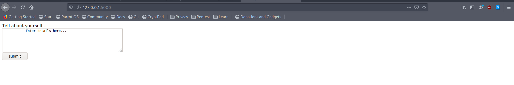
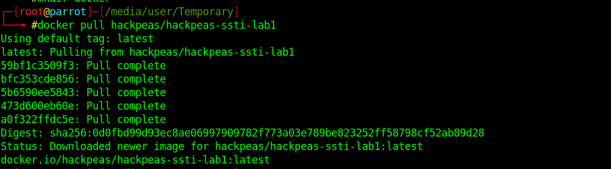
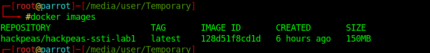
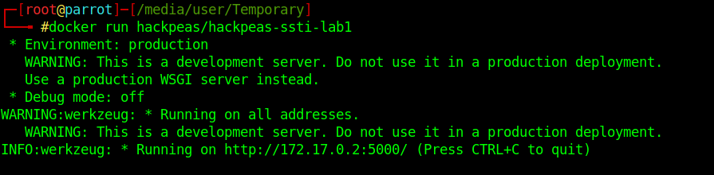

<h1><centre>CTFs</centre></h1>

<h2> CTF - temper the flask </h2>

<b>Description</b>: can't beleive this, jinja2 can be vulnerable... 

<b> Task </b>:Get the remote code execution on machine, and extract the content of flag.txt, file present in the web directory 
<b> Walkthrough </b>: Coming Soon   

<h2> Environment Setup </h2>
1 Install docker.io in your machine

for debian based linux:

> apt-get install docker.io

for windows:

follow the documentation: https://docs.docker.com/desktop/windows/install/

2 Pull the lab

> docker pull hackpeas/hackpeas-ssti-lab1

confirm that image is successfully pulled, with the following command

> docker images

You can see the image hackpeas/hackpeas-ssti-lab1

3 Running the image

> docker run hackpeas/hackpeas-ssti-lab1

