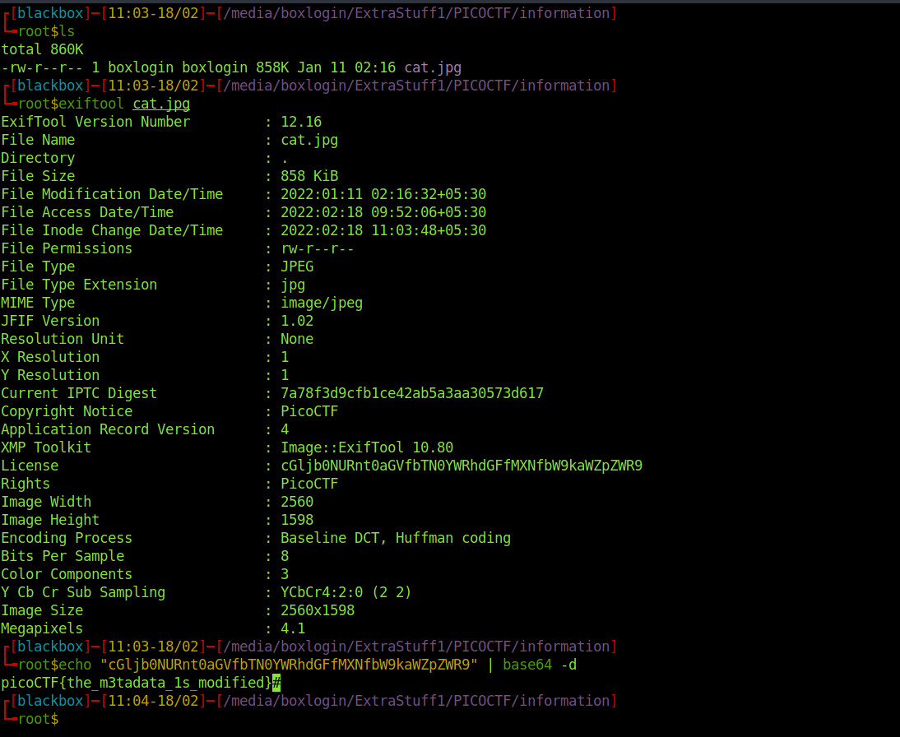

<h1><b>Information</b> PicoCTF writup</h1>
<h2>Writup</h2>
Video Writup: Coming Soon  
challange link: https://play.picoctf.org/practice/challenge/186?category=4&page=1  
points : 10

<b>Description</b>: Files can always be changed in a secret way. Can you find the flag? cat.jpg

So we have an Image file cat.png

on checking its metadata 

> exiftool cat.png

the license key seems to be an base 64 encoded strings, so on decoding it

> echo "cGljb0NURnt0aGVfbTN0YWRhdGFfMXNfbW9kaWZpZWR9" | base64 -d

we have our flag : icoCTF{the_m3tadata_1s_modified}

 
<b> thank you </b>
