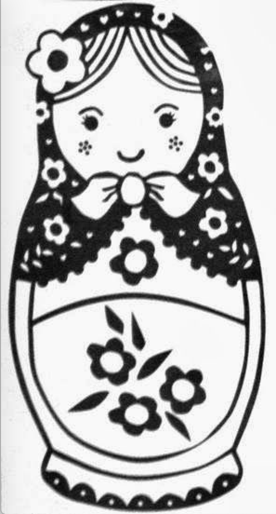
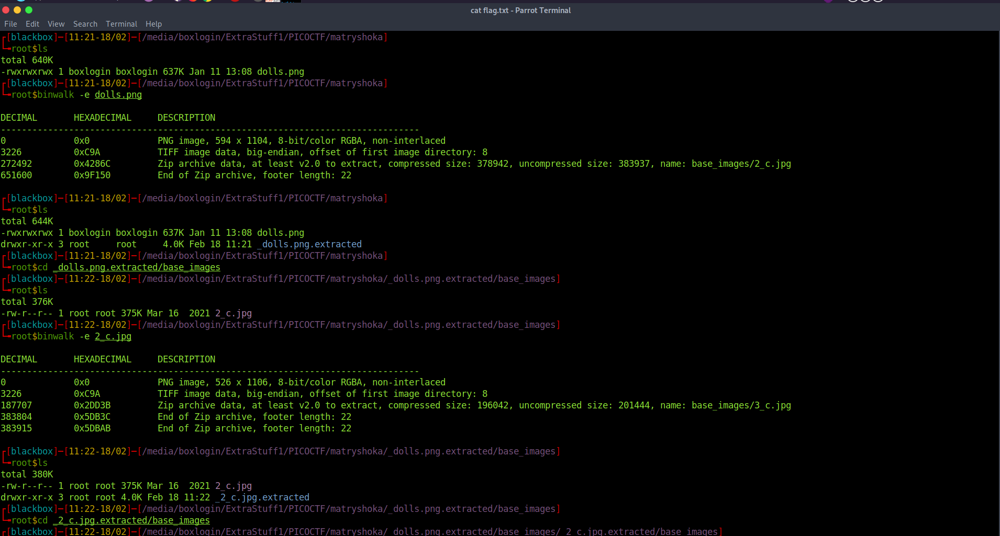
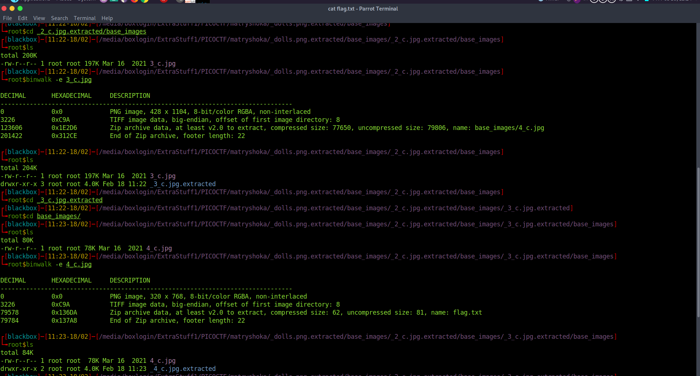
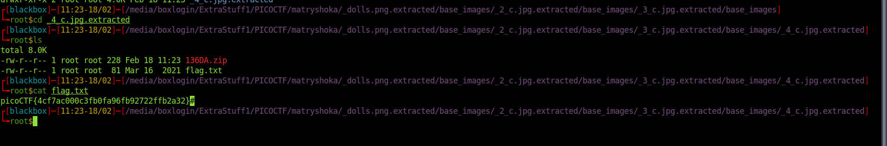

<h1><b>Matryoshka doll</b> PicoCTF writup</h1>
<h2>Writup</h2>
Video Writup: https://youtu.be/HavhxkqfpMg  
challange link: https://play.picoctf.org/practice/challenge/129?category=4&page=1  
points : 30

<b>Description</b>: Matryoshka dolls are a set of wooden dolls of decreasing size placed one inside another. What's the final one? Image: this
So we have an Image file dolls.png

on extracting hidden files with binwalk

> binwalk -e dolls.png

we discover another png file in base_images folder 

> binwalk -e 2_dolls.png

again we will have another image in base_images folder ,

and so on images will come on extracting upto fourth image

> binwalk -e 3_dolls.png

> binwalk -e 4_dolls.png

in 4th extraction, we have a file flag.txt containing our flag.

we have our flag : picoCTF{4cf7ac000c3fb0fa96fb92722ffb2a32}

 
<b> thank you </b>
