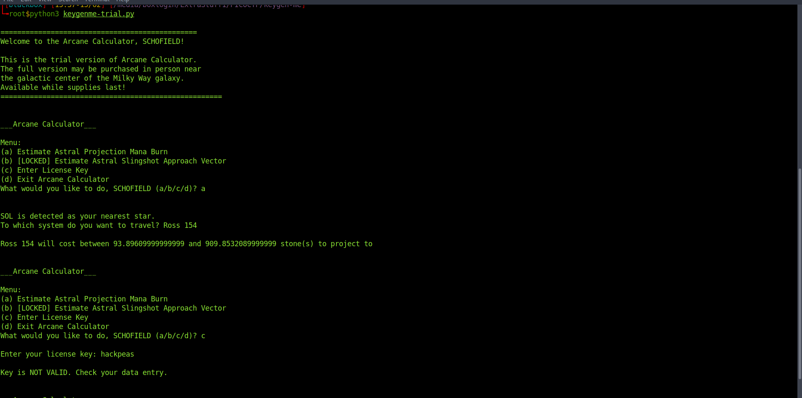
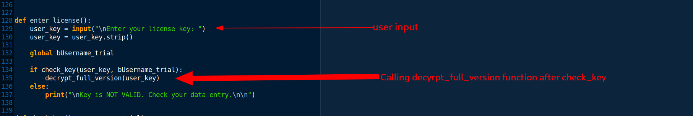
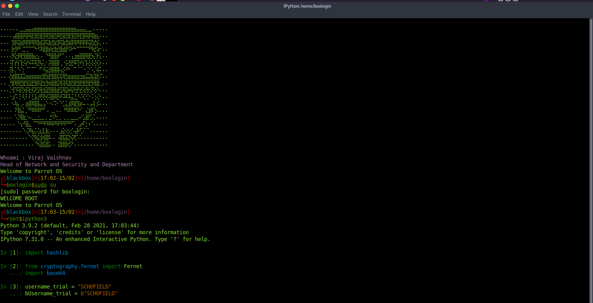
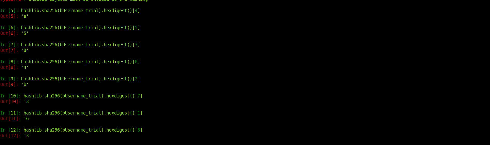

<h1><b>Keygenme-py</b> Challange from PicoCTF</h1>
<h2>Writup</h2>
challange link: https://play.picoctf.org/practice/challenge/121?category=3&page=1 <br>
points : 30

<b>Description</b>: the challenge contains one python file keygenme-trail.py. 


From the very first look, we can see some global variables, <b>key_part_static1_trial</b> is the first part of our flag which is given, <b> key_part_dynamic1_trial
</b> is second part which we have to guess, <b>ey_part_static2_trial = "}"</b> and <b>key_full_template_trial</b> is the complete flag.



This is an Arcane Calculator, which take the star system name as an input and predict the estimate cost of project.<br>
if we select option <b>c</b>, it will ask us for the license key, to get full version of calculator. from the code :)



when we select option <b>c</b>, first it will call the fucntion <b>check_key</b> with <b>user input</b> and <b>SCHOFIELD trial_username</b> as an argument.
if the function written true then it will decrypt the license key otherwise it will exit.
```
def check_key(key, username_trial):

    global key_full_template_trial

    if len(key) != len(key_full_template_trial):
        return False
    else:
        # Check static base key part --v
        i = 0
        for c in key_part_static1_trial:
            if key[i] != c:
                return False

            i += 1

        # TODO : test performance on toolbox container
        # Check dynamic part --v
        if key[i] != hashlib.sha256(username_trial).hexdigest()[4]:
            return False
        else:
            i += 1

        if key[i] != hashlib.sha256(username_trial).hexdigest()[5]:
            return False
        else:
            i += 1

        if key[i] != hashlib.sha256(username_trial).hexdigest()[3]:
            return False
        else:
            i += 1

        if key[i] != hashlib.sha256(username_trial).hexdigest()[6]:
            return False
        else:
            i += 1

        if key[i] != hashlib.sha256(username_trial).hexdigest()[2]:
            return False
        else:
            i += 1

        if key[i] != hashlib.sha256(username_trial).hexdigest()[7]:
            return False
        else:
            i += 1

        if key[i] != hashlib.sha256(username_trial).hexdigest()[1]:
            return False
        else:
            i += 1

        if key[i] != hashlib.sha256(username_trial).hexdigest()[8]:
            return False


        return True
```
if we look function check_key closely we can find some conditions :)
  - length of our input should be equal to <b>key_full_template_trial<b> length (flag)
  - first part of our input should be equal to <b>key_part_static1_final</b> which is picoCTF{1n_7h3_|<3y_of_
<br>                                                                                                          
from above two points, it is clear we need to put the correct flag as a license key to get full version of aracane calculator.
                                                                                                              

<p>This part is for checking that whether the second part of user input (corresponding to dynamic part of flag), is equal to this values or not, so we can just
conculde each value using ipython3 and can predict the dynamic part</p>

 > ipython3
 
 > from cryptography.fernet import Fernet
   
 > import base64
   
 > username_trial = "SCHOFIELD"
    
 >  bUsername_trial = b"SCHOFIELD"
    
  
  
  
  <h3><b>Decrypting Dynamic Part</b></h3>
  <b>Note</b> in function check_key , 2nd argument is bUsername_trial, which is named as username_trial within the function, in ipython3 I am taking 
   bUsername_trial , so don't get confuse of it.
 
 
  
  <h3>So our final flag is <b>picoCTF{1n_7h3_|<3y_of_e584b363}</b></h3><br>
  I also write an script to automatically exploit this, check :)
  https://github.com/veer1024/CTFs/blob/main/PICOCTF/Reversing/keygenme-py/keygenme-trial-sol.py <br>
  <b> Thank You</b>
                                                                                                              
