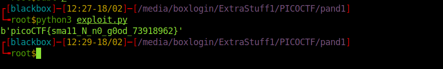

<h1><b>Mind your Ps and Qs</b> PicoCTF writup</h1>
<h2>Writup</h2>
Video Writup: https://www.youtube.com/watch?v=Pw9W3HeNbBU <br>
challange link: https://play.picoctf.org/practice/challenge/162 <br>
points : 30

<b>Description</b>: In RSA, a small e value can be problematic, but what about N? Can you decrypt this? values

we have an file with values of n,c,e
Decrypt my super sick RSA:
c: 964354128913912393938480857590969826308054462950561875638492039363373779803642185
n: 1584586296183412107468474423529992275940096154074798537916936609523894209759157543
e: 65537

First we need to find the value of p and q, when we put our on factordb.com we have our p and q =>
p = 2434792384523484381583634042478415057961
q = 650809615742055581459820253356987396346063

now we can write simple exploit, to calculate value of d and m. 
```
from Crypto.Util.number import *
c= 964354128913912393938480857590969826308054462950561875638492039363373779803642185
n= 1584586296183412107468474423529992275940096154074798537916936609523894209759157543
e= 65537
p = 2434792384523484381583634042478415057961
q = 650809615742055581459820253356987396346063

phi = (p-1)*(q-1)

d = inverse(e,phi)

m = pow(c,d,n)
print(long_to_bytes(m))

```

<br>
<b> thank you</b>
