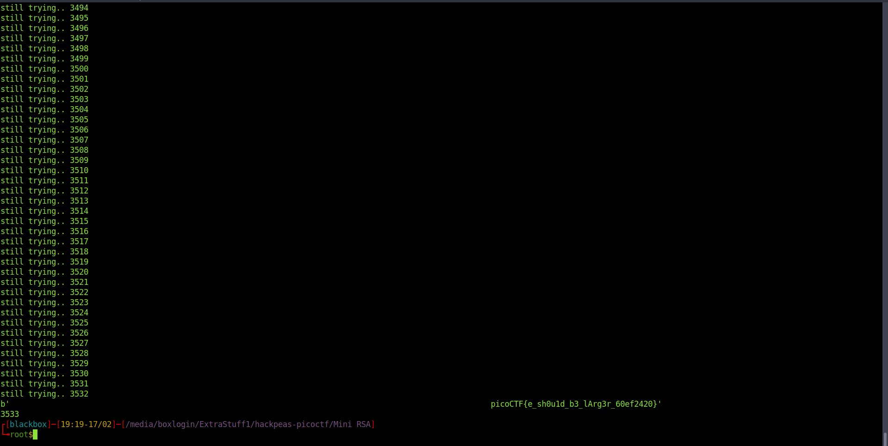

<h1><b>Mini RSA</b> PicoCTF writup</h1>
<h2>Writup</h2>
Video Writup: https://www.youtube.com/watch?v=1arJzf-zD_A <br>
challange link: https://play.picoctf.org/practice/challenge/188?category=2&page=1 <br>
points : 30

<b>Description</b>: What happens if you have a small exponent? There is a twist though, we padded the plaintext so that (M ** e) is just barely larger than N. Let's decrypt this:

we can write an exploit script to solve this challenge 
```
from Crypto.Util.number import *
import gmpy2
N= 29331922499794985782735976045591164936683059380558950386560160105740343201513369939006307531165922708949619162698623675349030430859547825708994708321803705309459438099340427770580064400911431856656901982789948285309956111848686906152664473350940486507451771223435835260168971210087470894448460745593956840586530527915802541450092946574694809584880896601317519794442862977471129319781313161842056501715040555964011899589002863730868679527184420789010551475067862907739054966183120621407246398518098981106431219207697870293412176440482900183550467375190239898455201170831410460483829448603477361305838743852756938687673
e = 3

ciphertext=2205316413931134031074603746928247799030155221252519872649649212867614751848436763801274360463406171277838056821437115883619169702963504606017565783537203207707757768473109845162808575425972525116337319108047893250549462147185741761825125


# C = M**3 % N => C = M**3 - N*x => M = (C + N*x)**1/3 => say we want to calculate Nth root of Y , then we 
# we can do that by using gmpy2 , for that => Nth root of Y = gmpy2.iroot(Y,N)

for x in range(10000):
   M = gmpy2.iroot(ciphertext + N*x , e)[0]
   #print(M)
   if b'pico' in long_to_bytes(M):
      print(x)
      print(long_to_bytes(M))
      break
   else:
      print(str(x)+"trying")

```

<br>
<b> thank you</b>
